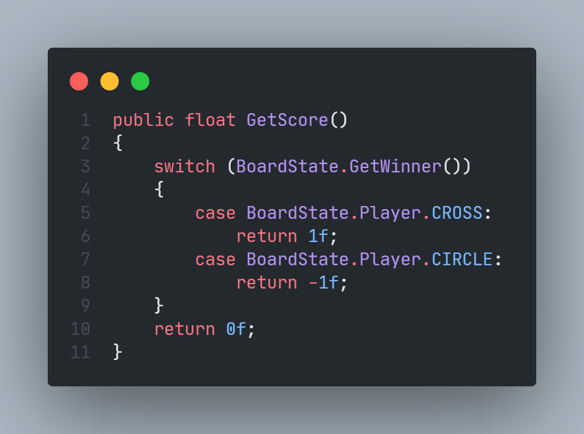
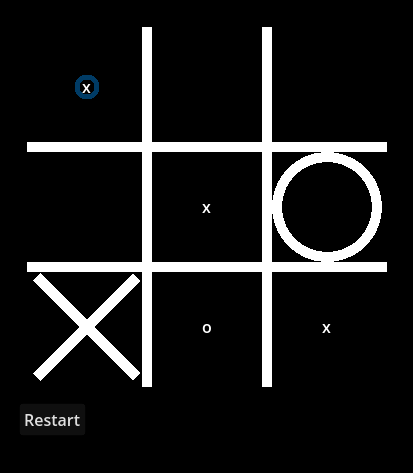

# MVP do algoritmo de minimax

Para esse MVP, foi implementado o algoritmo de minimax de uma maneira simples em um jogo da velha.

## Pontuação

O algoritmo nesse caso constrói a árvore de possibilidades inteira do jogo e atribui pontuação 1 para caso
o "X" tenha vencido, e -1 caso o "O" tenha vencido, qualquer outro caso a pontuação é 0.

## Árvore

A árvore é construída a partir do trecho de código a seguir,
a função é recursiva e chama a si mesma para cada um dos galhos da árvore, ela verifica se é possível fazer uma jogada em determinada casa e cria um objeto para o estado do tabuleiro se a jogada for feita

## Melhor jogada

No final, a função GetScore percorre a árvore e procura a pontuação das folhas, depois, caso seja vez do jogador "X", ele escolhe o galho com maior pontuação, caso seja "O", o galho com menor pontuação

## Funcionamento

A partir disso, após definidas as regras do jogo, é possível ter uma previsão precisa de qual jogador está em vantagem em qualquer momento da partida

Nessa imagem, é a vez do jogador "X", as casas marcadas com "X" garantem a vitória, as casas marcadas com "O" garantem a derrota, e as casas sem marcação levam ao empate, considerando que cada jogador jogue perfeitamente